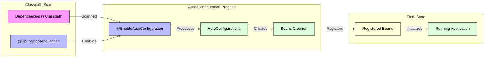
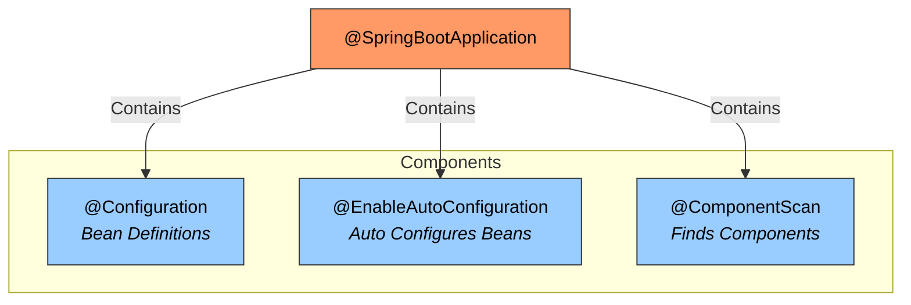

# 🚀 Spring Boot Interview Questions & Answers 🚀

## 1. Spring Boot Auto-Configuration Mechanism 🔄

Spring Boot auto-configuration is a smart mechanism that automatically configures your application based on dependencies present in your classpath 0:2. Here's how it works internally:

Dependency Detection- Spring Boot scans your project's dependencies
- Identifies potential configurations needed
- Creates configuration classes automatically

Auto-Configuration Process- Uses `@EnableAutoConfiguration` annotation
- Scans classpath for potential candidates
- Matches conditions to determine what to configure
- Creates and registers beans automatically



The diagram above illustrates the auto-configuration process where:

- 📦 Dependencies in Classpath: Your project's dependencies (like spring-boot-starter-web)
- 🎯 @SpringBootApplication: Your main application annotation that enables auto-configuration
- 🔄 @EnableAutoConfiguration: Scans and processes all potential configurations
- ⚙️ AutoConfigurations: Spring Boot's predefined configuration classes
- 📦 Beans Creation: Automatic creation of necessary Spring beans
- 🔑 Registered Beans: Beans registered in the application context
- 🚀 Running Application: Your final configured application

Example of auto-configuration in action:

```java
@SpringBootApplication // Enables auto-configuration
public class MyApplication {
    public static void main(String[] args) {
        SpringApplication.run(MyApplication.class, args);
    }
}
```

## 2. @SpringBootApplication Annotation 📝

@SpringBootApplication combines three powerful annotations 0:9:

- 🔧 @Configuration: Marks class as source of bean definitions
- ⚙️ @EnableAutoConfiguration: Enables auto-configuration
- 🔍 @ComponentScan: Scans for Spring components



## 3. Dependency Management 📦

Spring Boot simplifies dependency management through starter dependencies 0:13:

```xml
<dependency>
    <groupId>org.springframework.boot</groupId>
    <artifactId>spring-boot-starter-web</artifactId>
</dependency>
```

Key features:

- ✨ Version management handled automatically
- 🎯 Pre-configured compatible versions
- 📦 Bundled related dependencies

## 4. Component Annotations 🏗️

| Annotation | Purpose | Example Use Case |
| --- | --- | --- |
| @Component | Generic stereotype annotation | Utility classes |
| @Service | Service layer components | Business logic |
| @Repository | Data access objects | Database operations |
| @Controller | Web request handlers | REST endpoints |

## 5. Profile Configuration 🌍

Profiles allow different configurations for various environments 0:25:

```yaml
# application-dev.yml
spring:
  datasource:
    url: jdbc:postgresql://localhost:5432/devdb
    username: devuser
    password: devpass

# application-prod.yml
spring:
  datasource:
    url: jdbc:postgresql://prod-db:5432/proddb
    username: produser
    password: ${DB_PASSWORD}
```

Activate profiles using:

```java
@SpringBootApplication
public class MyApplication {
    public static void main(String[] args) {
        SpringApplication.run(MyApplication.class, "--spring.profiles.active=dev");
    }
}
```

## 6. Properties vs YAML 📄

Properties files are simple key-value pairs 0:46:

```properties
server.port=8080
spring.datasource.url=jdbc:mysql://localhost:3306/db
```

YAML offers more structure and nesting:

```yaml
server:
  port: 8080
spring:
  datasource:
    url: jdbc:mysql://localhost:3306/db
    username: user
    password: pass
```

## 7. Externalizing Configuration 🔒

Secure sensitive data using environment variables 0:32:

```yaml
# application.yml
database:
  username: ${DB_USERNAME}
  password: ${DB_PASSWORD}

# Environment variables
export DB_USERNAME=myuser
export DB_PASSWORD=mypassword
```

## 8. Exception Handling 🛡️

Implement global exception handling:

```java
@ControllerAdvice
public class GlobalExceptionHandler {
    @ExceptionHandler(value = Exception.class)
    public ResponseEntity<String> handleException(Exception ex) {
        return ResponseEntity.status(HttpStatus.INTERNAL_SERVER_ERROR)
                           .body("Error occurred: " + ex.getMessage());
    }
}
```

## 9. Request Validation 📝

Use annotations for request validation:

```java
@RestController
@RequestMapping("/api/users")
public class UserController {
    @PostMapping
    public ResponseEntity<User> createUser(@Valid @RequestBody User user) {
        // Validated user object
        return ResponseEntity.ok(user);
    }
}

public class User {
    @NotNull(message = "Name is required")
    private String name;
    
    @Email(message = "Invalid email format")
    private String email;
}
```

## 10. Spring Data JPA 🗄️

Spring Data JPA simplifies database operations 0:38:

```java
@Entity
public class User {
    @Id
    @GeneratedValue(strategy = GenerationType.IDENTITY)
    private Long id;
    
    @Column(nullable = false)
    private String name;
}

public interface UserRepository extends JpaRepository<User, Long> {
    // CRUD operations provided automatically
    Optional<User> findByName(String name);
}
```

## 11. Repository Interfaces 📁

Repository hierarchy provides increasing functionality:

- 📝 CrudRepository: Basic CRUD operations
- 📊 PagingAndSortingRepository: Adds pagination and sorting
- 🔍 JpaRepository: Additional JPA-specific features

## 12. Service Discovery with Eureka 📍

Register services with Eureka server:

```java
@SpringBootApplication
@EnableDiscoveryClient
public class ServiceApplication {
    public static void main(String[] args) {
        SpringApplication.run(ServiceApplication.class, args);
    }
}
```

## 13. Inter-Service Communication 📱

Using Feign client for service communication:

```java
@FeignClient(name = "user-service")
public interface UserServiceClient {
    @GetMapping("/api/users/{id}")
    User getUser(@PathVariable("id") Long id);
}
```

## 14. Sleuth and Zipkin 🕵️‍♂️

Add tracing to your application:

```java
@SpringBootApplication
public class TracedApplication {
    public static void main(String[] args) {
        SpringApplication.run(TracedApplication.class, args);
    }
}
```

Dependencies needed:

```xml
<dependency>
    <groupId>org.springframework.cloud</groupId>
    <artifactId>spring-cloud-starter-sleuth</artifactId>
</dependency>
<dependency>
    <groupId>org.springframework.cloud</groupId>
    <artifactId>spring-cloud-starter-zipkin</artifactId>
</dependency>
```

## 15. Testing 🧪

Unit test example:

```java
@RunWith(SpringRunner.class)
public class UserServiceTest {
    
    @Autowired
    private UserService userService;
    
    @MockBean
    private UserRepository userRepository;
    
    @Test
    public void testCreateUser() {
        // Given
        User user = new User("John Doe");
        
        // When
        User savedUser = userService.createUser(user);
        
        // Then
        assertNotNull(savedUser);
        assertEquals("John Doe", savedUser.getName());
    }
}
```

## 16. Prometheus and Grafana Monitoring 📊

Configure monitoring:

```yaml
management:
  endpoints:
    web:
      exposure:
        include: "*"
  metrics:
    export:
      prometheus:
        enabled: true
  endpoint:
    health:
      show-details: always
```

## 17. Docker Deployment 🚢

Create Dockerfile```dockerfile
FROM openjdk:17-jdk-alpine
ARG JAR_FILE=target/*.jar
COPY ${JAR_FILE} app.jar
ENTRYPOINT ["java","-jar","/app.jar"]
```

Build and deploy```bash
docker build -t my-spring-boot-app .
docker run -p 8080:8080 my-spring-boot-app
```

## 18. Performance Analysis 📈

Tools for performance analysis:

- 🔄 VisualVM: Memory and CPU profiling
- 📊 Java Mission Control: Production monitoring
- 📊 Prometheus + Grafana: Metrics visualization
- 🔄 Spring Boot Actuator: Application health checks

Remember to always follow best practices:
- ✨ Keep configurations environment-specific
- 🔒 Secure sensitive data
- 📊 Monitor application metrics
- 🧪 Implement comprehensive tests
- 🔄 Use proper dependency injection patterns
